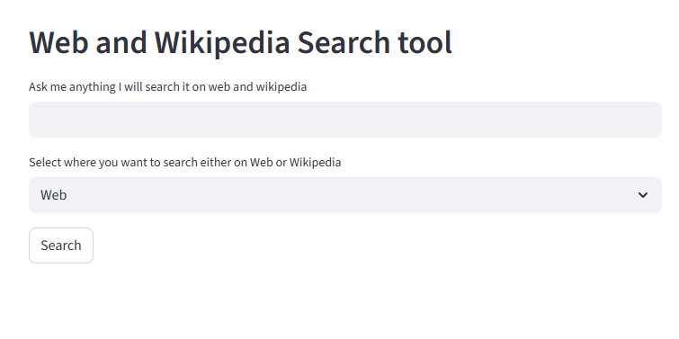

# chatbot_web_wikipedia_search
This project is a chatbot web app that lets you search both the web (via Tavily API) and Wikipedia using a conversational interface powered by LLMs. Built with [Streamlit](https://streamlit.io/), [LangChain](https://python.langchain.com/), and [Groq’s Gemma2-9b-it model](https://groq.com/).

## Features

- 🔍 Search the web or Wikipedia from a single chat interface
- 🦜 Uses LangChain agents for smart tool selection
- 🌐 Integrates Tavily API for real-time web search
- 📚 Wikipedia search via LangChain tools
- ⚡ Fast, interactive UI with Streamlit

## How it works

1. Enter your question in the chat box.
2. Choose whether to search the Web or Wikipedia.
3. Click "Search" to get an answer powered by LLMs and the selected data source.

## Example

## Tech Stack

- Python
- Streamlit
- LangChain
- Groq LLMs
- Tavily API
- Wikipedia API
